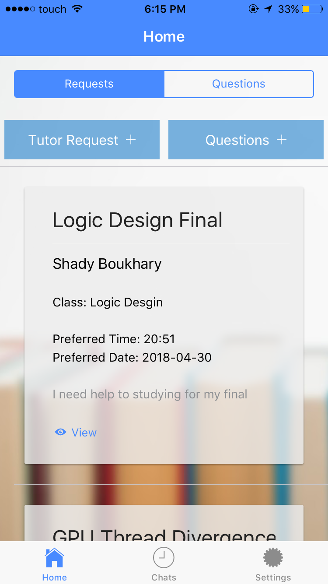

# Genius On Demand Mobile Application

Mobile app started at the Big Blue Hackathon in Wichita Falls, TX. It provides college students with a forum to post questions, find tutors nearby, and chat with other students based on majors and interests.

## Screenshots of the current version of the application

   
    
 

## Built with

* **Ionic Framework Cli: 3.19.1**
* **Apache Cordova 8.0**
* **Backend: Firebase**
 
## Deployment

* **Not yet available**

## Authors

* **Shady Boukhary** 

## Additional Information

## References

* https://ionicframework.com/docs/
